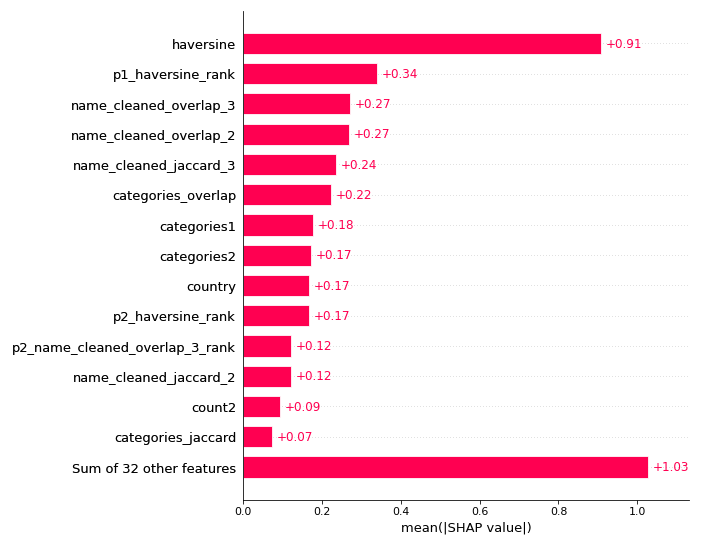
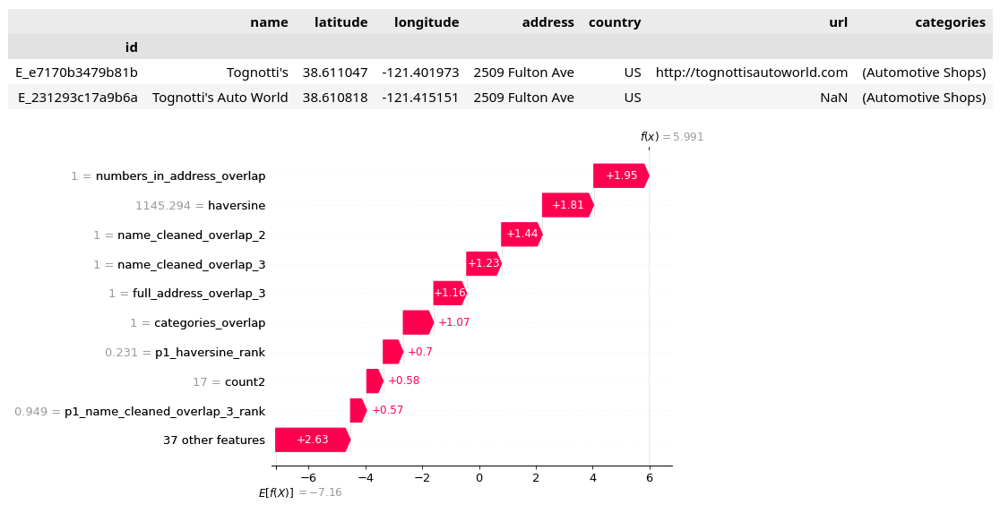

# FoursquareLocationMatching
Foursquare - Location Matching https://www.kaggle.com/competitions/foursquare-location-matching

Part of 53/1079 solution using sklearn, LightGBM, CatBoost, SHAP

### Most important features

### Analyzing feature impacts on individual predictions using SHAP
